# LaunchMind — Complete Project Brief v2
**AI Marketing Operating System for App Founders**
Vijay Tomar · Phoenix, AZ · July 2026 · Built with Claude Code + Claude Sonnet 4.6

---

## Overview

| | |
|---|---|
| **What it is** | AI marketing OS — paste app URL → get 30/60/90 day strategy + content assets + managed ads |
| **Markets** | USA (Stripe/USD) + India (Razorpay/INR) from day 1 |
| **Tiers** | Free · Solo $19/₹999 · Builder $49/₹2,499 · Studio $99/₹4,999 |
| **AI models** | Claude Sonnet (strategy/copy) · Haiku (scoring/short) · ElevenLabs (voice) · Creatomate (video) · Flux.1 Schnell (images) |
| **Stack** | Next.js 14 + Fastify + Supabase + Oracle VM + Vercel |
| **Build method** | Claude Code — founder-led, no agency |
| **Build state** | Phase 5 Week 20 — all core features complete |

---

## 1. Product Vision

LaunchMind solves one specific problem: solo app founders know how to build apps but not how to market them. They guess at channels, burn money on agencies, or do nothing. LaunchMind gives them a CMO-level marketing system starting with just an App Store URL.

### Core Loop

1. **Discover** — paste App Store / Play Store / Website URL → AI scrapes app metadata, 50 reviews, competitors, ASO keywords, website signals, and collects all existing marketing images
2. **Confirm** — AI generates ICP brief → founder reviews every field, corrects errors, adds MOAT and best customer quote, validates competitors, selects markets
3. **Execute** — AI generates 22 structured content assets for 6 channels: WhatsApp, Meta, Google UAC, ASO, Email, LinkedIn + Video + Community + Social Proof + visual ad creatives
4. **Learn** — every Sunday: brief arrives with what worked, what to kill, next actions → content regenerates with learnings + performance data applied

### Pricing

| Tier | Price USA | Price India | Tokens/mo | Key Features |
|---|---|---|---|---|
| Free | $0 | ₹0 | 50 | 1 product · strategy preview only · no posting |
| Solo | $19/mo | ₹999/mo | 300 | 1 product · 1 channel · full strategy + weekly brief |
| Builder | $49/mo | ₹2,499/mo | 1,000 | 3 products · all channels · Meta + Google · USA + India |
| Studio | $99/mo | ₹4,999/mo | 3,000 | 10 products · workspaces · white-label · API access |

### Token Cost Reference

| Action | Tokens | Model |
|---|---|---|
| Strategy generation | 50 | Sonnet |
| Weekly brief | 20 | Sonnet |
| Content asset batch | 20 | Sonnet |
| Review analysis | 15 | Haiku |
| ICP structuring | 10 | Haiku |
| Brand voice extract | 10 | Haiku |
| Brand voice apply | 5 | Haiku |
| Scoring / classify | 5 | Haiku |

---

## 2. Full Tech Stack

### 2.1 Frontend

| Layer | Tool | Notes |
|---|---|---|
| Framework | Next.js 14 App Router | Server + client components, file-based routing |
| UI | Tailwind CSS + shadcn/ui | Design tokens; never build custom shadcn equivalents |
| Design system | Slate & Sage (custom) | Light theme · `#28304a` sidebar · `#059669` primary |
| Typography | Syne + DM Sans + DM Mono | Syne=display, DM Sans=body, DM Mono=data/metrics |
| Icons | @tabler/icons-react v3 | Outline only, never filled. **v3 uses `Icon` prefix not `Tb`** |
| Hosting | Vercel | Auto-deploy on push to main |
| Auth | Supabase Auth SDK | 15-min JWT + rotating refresh tokens |
| Analytics | PostHog | After cookie consent only |
| Error tracking | Sentry | Client-side capture |

### 2.2 Backend

| Layer | Tool | Notes |
|---|---|---|
| Runtime | Node.js + Fastify | Typed routes, Zod validation on all inputs |
| Hosting | Oracle Cloud VM | Docker + Nginx + GitHub Actions CI/CD |
| Database | Supabase Postgres | RLS on every table. Additive migrations only. |
| Vector store | pgvector (in Supabase) | ICP embeddings — no separate Pinecone |
| Queue | Upstash Redis + BullMQ | Weekly cron + job retries, exponential backoff |
| Scraping static | Cheerio | App Store metadata + website scraping |
| Scraping dynamic | Playwright | Play Store + reviews (sandboxed worker) |
| Token encryption | AES-256 + AWS KMS | OAuth tokens only — key never in DB |
| Perimeter | Cloudflare WAF | DDoS, rate limiting, TLS 1.3 only |
| Email | Resend | Transactional + weekly brief delivery |
| Payments USA | Stripe | Subscriptions + one-time token top-ups |
| Payments India | Razorpay | UPI + cards + net banking |
| Error tracking | Sentry | Wired into Fastify error handler |
| Audit logs | Axiom | Immutable append-only |

### 2.3 AI Services

| Service | Model/API | Used For |
|---|---|---|
| Claude Sonnet | claude-sonnet-4-6 | Strategy, long-form copy, video scripts, LinkedIn posts, weekly brief narrative |
| Claude Haiku | claude-haiku-4-5-20251001 | Short assets (UAC, ASO), quality scoring (0–1), char limit enforcement, Hinglish translation |
| ElevenLabs | TTS API | Voiceover for Reels, Shorts, App Store preview, WhatsApp voice note. DEFAULT: natural AI voice (Indian English / Hindi / Hinglish). OPTIONAL: founder voice clone from 60-sec sample |
| Creatomate | Video assembly API | Frames + MP3 audio + text overlays → final MP4. Handles timing, captions, transitions |
| Replicate | Flux.1 Schnell | AI marketing images. 3 styles: photorealistic · graphic · mockup. Anti-split prompts. Logo compositing via Sharp. **Phase 1: uses real app screenshots for mockup style — no AI hallucination** |

### 2.4 Image Generation Pipeline (Built Week 20)

This is the visual ad creative system. Every new product intake automatically collects real marketing images.

**At Intake (intakeWorker.ts ~75% progress step):**
`marketingImagesService.ts` collects from 3 sources and stores permanently in Supabase Storage:
1. **App Store / Play Store screenshots** — up to 5, downloaded to `content-assets/{founderId}/{productId}/source-images/screenshot_N.png`
2. **Website hero/feature images** — OG image + hero section imgs + large srcset, stored as `hero_N.jpg`
3. **Google Custom Search Images** — `"{appName}" mobile app` query, stored as `web_N.jpg` (requires GOOGLE_CUSTOM_SEARCH_API_KEY)

URLs are permanent Supabase Storage public URLs (store CDN URLs expire). Stored in `products.scraped_meta.marketingImages[]`.

**At Generate Image (contentService.ts):**

| Style | Source | Output |
|---|---|---|
| `mockup` + real screenshots exist | Real screenshot from Storage (no Flux.1) | Logo composited bottom-right, Sharp PNG |
| `mockup` + no screenshots | Flux.1 photorealistic fallback | Logo composited if configured |
| `photorealistic` | Flux.1 with real app context hint | Logo composited if configured |
| `graphic` | Flux.1 illustration style | Logo composited if configured |

**Anti-hallucination system:** `ANTI_SPLIT` + `ANTI_TEXT` + `ANTI_DARK` negative prompts prevent split-panel before/after compositions. `_extractPositiveScene()` strips "left shows X, right shows Y" patterns from briefs before sending to Flux.1.

**Logo compositing:** Sharp resizes logo to 14% of image width, places bottom-right at 4% padding. Transparent background preserved.

---

## 3. Data Model

12 tables. Every table has RLS — founders access only their own data. All migrations additive only (001–030 applied). No columns ever dropped or renamed.

### 3.1 `founders`
```
id, email, name, plan (free/solo/builder/studio), mfa_enabled, token_balance,
onboarding_step, deleted_at (soft delete — email anonymised on GDPR delete),
created_at, updated_at
```

### 3.2 `products`
```
id, founder_id, name, store_url, platform (app_store/play_store),
app_store_url, play_store_url, website_url,
category, markets (text[]), price_tier,
confirmed_icp (JSONB), competitor_set (JSONB),
scraped_meta (JSONB — includes marketingImages[], screenshots[]),
website_meta (JSONB — title, description, logoUrl, ogImage, heroImages[]),
founder_context (JSONB — budget, stage, goal, audience, MOAT, bestCustomerQuote, etc.),
screenshot_analysis (JSONB — summary, tone, primaryColor),
brand_voice_profile (JSONB),
content_preferences (JSONB — text/video/visual/community/socialProof prefs + logoUrl + imageStyle),
selected_markets (text[]), primary_channel (text), excluded_channels (text[]),
intake_step (0=new, 1=scraping, 2=scraped, 3=context, 4=screenshots, 6=confirmed),
icp_embedding (vector 1536), workspace_id,
archived_at, archive_reason,
last_scraped_at, created_at, updated_at
```

### 3.3 `platform_tokens`
```
id, founder_id, platform (meta/google/whatsapp/linkedin/email),
encrypted_token (AES-256 — NEVER returned to frontend),
kms_key_id, scopes (text[]), expires_at, revoked_at, created_at
UNIQUE(founder_id, platform)
```

### 3.4 `campaigns`
```
id, product_id, founder_id,
channel (meta/google/whatsapp/linkedin/email/aso_rewrite),
market (usa/india), status (draft/pending_approval/approved/launched/paused/completed),
hook_type, copy_text, audience_config (JSONB), spend_cap (JSONB),
external_campaign_id, action, ai_tokens_consumed,
approved_at (NULL = NOT approved — hard server-side gate),
launched_at, created_at, updated_at
```
**Rule:** No campaign ever posts to any platform unless `approved_at` IS NOT NULL. Checked in Fastify route handler. Frontend cannot bypass.

### 3.5 `campaign_metrics`
```
id, campaign_id, founder_id, week_start (date),
impressions, clicks, installs, cpi, ctr, roas,
top_performing_asset, raw_platform_data (JSONB), collected_at
UNIQUE(campaign_id, week_start)
```

### 3.6 `weekly_briefs`
```
id, product_id, founder_id, week_of (date),
what_worked, what_to_kill, next_actions (JSONB),
generated_assets (JSONB), ai_tokens_consumed,
status (draft/sent/acknowledged), sent_at, created_at
UNIQUE(product_id, week_of)
```

### 3.7 `content_assets`
```
id, product_id, founder_id,
asset_type (22 types — see Section 5),
channel, market, language,
text_content, structured_data (JSONB),
media_url (video/audio/image — Supabase Storage URL),
media_type, duration_seconds, thumbnail_url,
quality_score (0–1, Haiku-scored), quality_flags (JSONB),
generation_week, hook_angle, status,
auto_approved, approved_at,
regen_count (max 3/week), regen_reasons (JSONB),
render_started_at, installs, impressions, cpi,
model_used, created_at, updated_at
```

### 3.8 `content_learnings`
```
id, product_id, founder_id, channel,
learning_type (regen_reason/approved/winner/loser),
insight, applies_to (text[]), week_number, created_at
```

### 3.9 `playbook_signals` — ANONYMISED
```
id, category, market, channel, hook_type, price_tier,
install_delta_pct, conversion_rate, retention_d7, week_number,
signal_embedding (vector 1536), created_at
No founder_id. No product_id. No PII. Never deleted.
52 seed rows (migrations 011 + 018). authenticated: SELECT only.
```

### 3.10 `embedding_store`
```
id, founder_id, product_id,
type (icp/campaign_history/learning_log),
content, embedding (vector 1536), metadata (JSONB), created_at
```

### 3.11 `audit_logs` — IMMUTABLE
```
id, founder_id, action, resource_type, resource_id,
metadata (JSONB), ip_address, user_agent, created_at
INSERT only. UPDATE + DELETE revoked from all non-superuser roles. Never deleted.
```

### 3.12 `workspaces` (Studio tier)
```
id, founder_id, name, client_name, created_at
```

---

## 4. Security Rules (Non-Negotiable)

- **Secrets:** `.env.local` only (gitignored). Never committed. Never in DB.
- **OAuth tokens:** AES-256 encrypted before DB write. Key in AWS KMS only — never in DB, never in env.
- **`platform_tokens.encrypted_token`:** NEVER returned to frontend under any circumstance.
- **JWT:** 15-min access tokens + rotating refresh tokens.
- **MFA:** TOTP enforced for all accounts — cannot be disabled by users.
- **RLS:** Every founder-data table has `founder_id = auth.uid()` policy. No exceptions.
- **Campaigns:** `approved_at` must be non-null before any platform post. Hard Fastify gate.
- **Spend guardrail:** Before paid campaign creation, fetch `spend_cap` + current week spend. Reject 422 if over cap.
- **Anomaly detection:** New device/country → re-auth required + Resend alert + audit log entry.
- **SAST:** Semgrep + ESLint security plugin — blocks merge on HIGH+.
- **DAST:** OWASP ZAP against staging before phase promotion.
- **Dependency scan:** npm audit + Snyk — blocks deploy on HIGH+ CVE.
- **GDPR:** `DELETE /founders/me` purges all personal data. `GET /founders/me/export` returns JSON. `playbook_signals` not deleted (PII-free).

---

## 5. Content Generation OS

### 5.1 All 22 Asset Types

**Text assets:**

| Asset Type | Channel | Limit | Key Rule |
|---|---|---|---|
| `whatsapp_broadcast` (×3 variants) | whatsapp | 160 chars each | painFirst · socialProof · reEngagement. Hinglish variant if language=hinglish |
| `meta_headline` (A/B) | meta | 40 chars each | Both variants required. Pain-first or MOAT-forward |
| `meta_body_india` | meta | 125 chars | Separate copy per market. MOAT in one sentence |
| `meta_body_usa` | meta | 125 chars | Separate copy per market |
| `google_uac_variants` (×5) | google | 30 chars each | V1=pain V2=MOAT V3=social proof V4=feature V5=quote |
| `aso_subtitle` | aso | 30 chars | Primary keyword + pain-first. Different App Store vs Play Store |
| `aso_description_opening` | aso | 250 chars | First 3 lines before "Read more" — highest conversion lever |
| `email_day1` | email | 50 char subject | Onboarding. Pain → solution |
| `email_day5` | email | 50 char subject | Re-engagement. Timed to dropOffPoint − 2 days |
| `email_day14` | email | 50 char subject | Review request |
| `linkedin_founder_story` | linkedin | 3,000 chars | Opens with MOAT hook. "Why I built this" narrative |
| `linkedin_data_post` | linkedin | 3,000 chars | Build-in-public. Metrics + learnings |
| `community_whatsapp_group` | whatsapp | — | Warm network post for India WhatsApp groups |
| `community_facebook` | meta | — | Facebook group discussion post |
| `community_indiehackers` | other | — | Build-in-public Indie Hackers post |
| `community_twitter_thread` | other | — | Twitter/X thread (array of tweets) |
| `social_proof_case_study` | other | — | Metrics-based case study |
| `social_proof_testimonial` | other | — | Quote card brief for design |
| `social_proof_review_response` | other | — | Positive + negative review response templates |
| `meta_image_brief` | meta | — | Visual brief → Flux.1 image generation |
| `carousel_brief` | meta | — | Carousel brief → Flux.1 image generation |

**Video/audio assets:**

| Asset Type | Duration | Pipeline |
|---|---|---|
| `video_reels_30s` | 30 sec | Claude Sonnet script (4 scenes) → ElevenLabs MP3 → Creatomate MP4 (1080×1920) |
| `video_shorts_60s` | 60 sec | Claude Sonnet script (5 scenes, adds social proof moment) → ElevenLabs → Creatomate |
| `video_app_store_preview` | 30 sec | Real app screenshots as frames → ElevenLabs → Creatomate (886×1920) |
| `whatsapp_voice_note` | 30 sec | ElevenLabs MP3 only (no video). Hinglish by default |

Video cost: ~$0.43/video (ElevenLabs $0.05 + Creatomate $0.25 + storage $0.00).
**Video NEVER auto-approves regardless of approval_mode setting.**

### 5.2 Haiku Quality Scoring

Every text asset scored 0–1 by Claude Haiku before saving. Score < 0.7 = auto-regenerate (up to 2 retries). Scored on: char limit compliance, MOAT present, pain-first opening, no hallucinated claims, market-appropriate tone.

### 5.3 Approval Model Progression

| Stage | Trigger | Behaviour |
|---|---|---|
| Manual (Weeks 1–2) | Default from signup | Every asset shown, approve button required |
| One-tap (Weeks 3–4) | After 3 weeks of use | "Approve all text assets" button. Can still edit/regen. |
| Auto (Week 5+) | After 5 weeks of use | Generates Sunday, publishes Tuesday unless owner taps "Hold" |
| Paid channels | Always | Meta + Google NEVER auto-approve. Always explicit. |
| Video assets | Always | Founder must watch and approve. No exceptions. |

### 5.4 Learning Loop

Weekly: `content_learnings` table captures regen reasons, approved winners, killed losers. Applied as context in next week's content generation. Updates `brand_voice_profile` on products. Prevents same weak patterns re-appearing.

---

## 6. UX — All Screens (Current State, Week 20)

### Design System: Slate & Sage

**Colours:**
- `--page: #f2f3f6` — app background
- `--surface: #ffffff` — cards, topbar, modals
- `--raised: #eceef3` — inputs, metric blocks
- `--sidebar: #28304a` — left nav (dark navy)
- `--sage: #059669` — primary CTA, success, active states
- `--ink: #1b1f2e` — primary text
- `--ink2: #626880` — secondary text
- `--indigo: #4f46e5` — accent (current plan, badges)
- `--amber: #d97706` — India market badge, warnings

**Typography:** Syne (display/headings) · DM Sans 13px (body) · DM Mono (metrics/numbers)

**This is a LIGHT-THEME app. Dark backgrounds are never used for app pages.**

---

### Auth screens (3 screens)

**`/login`**
LaunchMind wordmark (Syne, `--ink`), subline "AI marketing OS". Email + password fields (`bg-raised`). Sage "Sign in" button. Google OAuth button. Link to signup. MFA redirect after sign-in if enabled.

**`/signup`**
Name + email + password. Sage "Create account" button. Google OAuth. Link to login.

**`/mfa`**
6-digit TOTP input. "Verify" button. "Lost authenticator?" link. Cannot be bypassed.

---

### Dashboard layout (persists across all dashboard screens)

**Sidebar (196px, `bg-sidebar` dark navy):**
- LaunchMind logo + wordmark (top)
- Nav items: Dashboard · Products · Campaigns · Briefs · Insights · Workspaces · Channels · Billing · Settings
- Active item: `bg-[--sage-d]` border `[--sage-b]` text `[--sage-l]`
- Inactive: `text-[--s-text2]` hover `bg-white/6`
- Token balance chip at bottom (mono font, amber warning if < 20% remaining)
- User email + avatar at very bottom

**Topbar (`bg-surface`, border-bottom):**
- Breadcrumb (current section)
- Notification bell
- "New product" button (sage, top-right)

---

### `/dashboard` — Main Dashboard

4-column metric grid (top):
- **Products** — count of active products
- **Campaigns** — count of launched campaigns
- **Installs this week** — sum from campaign_metrics
- **Top channel** — highest installs channel name

2-column main row:
- **LEFT — Products list** (scrollable): each row has app name, market badges (USA sage / India amber), ICP confirmed checkmark, "View strategy →" link
- **RIGHT — Latest brief** (scrollable): what worked narrative, what to kill, AI-generated summary

Channel Performance table (bottom):
- Columns: Channel · Impressions · Clicks · Installs · CPI · ROAS
- One row per active channel

---

### `/dashboard/products` — Products List

Header: "Products" + "Add product" button (sage).

Active product cards (grid):
- App name (Syne bold) + category
- Market badges: USA (`bg-[--sage-d]`) + India (`bg-[--amber-d]`)
- ICP confirmed checkmark (sage)
- Platform badge (App Store / Play Store)
- Three-dot overflow menu (ProductMenu component):
  - View strategy
  - Edit context
  - Archive (→ confirmation dialog, amber warning)

Archived section (collapsed at bottom, expandable):
- "N archived products" toggle
- Each archived product: name + archived date + "Restore" button + "Delete permanently" button (requires typing DELETE)

---

### 7-Step Product Intake (`/dashboard/products/new/*`)

IntakeSteps progress bar (top of every step): 7 steps with labels and completion indicators.

**Step 1: URLs** (`/products/new`)
Three URL inputs: App Store URL · Play Store URL · Website URL. Platform auto-detected. At least one store URL required. "Analyse my app →" sage button. ~10 seconds for founder.

**Step 2: Your Story** (`/products/new/context`)
5 conversational sections (ChipGroup + text inputs):
- Conv 1: Budget (chips: "< $500/mo" · "$500–2k" · "$2k–10k" · "$10k+") + stage + primary goal
- Conv 2: Audience size + warm network (chips: WhatsApp group / LinkedIn connections / Email list) + geography + language (chips: English / Hindi / Hinglish / Tamil / Telugu)
- Conv 3: Channels tried (chips: WhatsApp / Meta / Google / LinkedIn / ASO / Email) + monetisation + drop-off point + first user action
- Conv 4: MOAT (text) + peak season + screenshot upload (drag-and-drop)
- Conv 5: Best customer quote (textarea — used verbatim in all copy)

**Step 3: Analysis** (`/products/new/analysis`)
Live progress (6 items, each with spinner → checkmark):
- App Store / Play Store metadata
- Reviews analysed
- Finding competitors
- Scanning your website
- Matching playbook signals
- Building founder-specific plan
- *(internally: + collecting marketing images at ~75% — not shown as a step)*

Elapsed timer (amber if > 60s). "← Start over" button.

**Step 4: ICP Review** (`/products/new/icp`)
Every AI-generated field is inline-editable:
- Target user (text)
- Primary market (select)
- Pain points (chip list — add/remove)
- Copy signals (chip list — accept/reject each)
- Price tier
- Category

"Looks good, next →" sage button.

**Step 5: Competitors** (`/products/new/competitors`)
List of AI-found competitors. Each has: name, rating, top complaint, gap vs your app.
- ✓ Confirm (keeps as competitor)
- ✗ Reject (removes)
- + Add competitor (manual entry)

**Step 6: Markets** (`/products/new/markets`)
4-market grid (USA · India · UK · Canada).
- Each market card: CPI estimate, channel recommendation
- USA: sage badge. India: amber badge.
- "Tried channel" warning: amber chip if founder said they tried this channel in Step 2
- Pick ONE primary channel for Week 1 (radio select)

**Step 7: Confirm** (`/products/new/confirm`)
3-column summary:
- LEFT: Scraped app data (name, rating, category, install range)
- CENTRE: ICP brief (target user, pain points, markets)
- RIGHT: MOAT box + best customer quote

Brand assets card (NEW Week 20):
- Logo preview (48×48 px)
- Logo URL input (pre-filled if auto-detected from website)
- "Include logo in generated images" toggle (default ON)

"Generate strategy →" sage button (calls `POST /products/:id/strategy/generate`).

---

### `/dashboard/products/[id]/strategy` — Strategy Page

Header: app name + "Marketing Strategy" + "30/60/90 day plan for USA + India"

Tabs: Week 1–4 · Week 5–8 · Week 9–12

Each week: channel recommendation card, copy hook for that week, asset preview.

Playbook Insights box (Builder/Studio only):
- "Similar apps at your price tier in USA achieved X% install uplift with this hook type"
- Solo/Free: locked with "Upgrade to Builder to unlock" message

India tab: hidden for Free/Solo tiers.

---

### `/dashboard/campaigns` — Campaigns

Amber banner (if any campaigns are in `pending_approval` status): "N campaigns waiting for your approval"

Table columns:
- Channel (bare colored icon — no background box)
- Product
- Market badge (USA/India)
- Status badge (draft/pending/approved/launched/paused)
- Budget
- Installs
- CPI
- Actions (Approve · Pause · View)

Approval dialog (modal):
- Copy preview
- Audience config summary
- Spend cap
- "Approve and launch" sage button

---

### `/dashboard/briefs` — Weekly Briefs

2-column layout (1fr 1fr, stacks to 1-col on < xl):
- **LEFT — Brief narrative**: "What Worked" section + "What to Kill" section + "Next Actions" list
- **RIGHT — Generated Assets**: AssetBlock grid (2-up)

**AssetBlock component** (renders all 9 visual/audio/text types):
- Text assets: copy preview + Edit + Approve + Regenerate
- Audio assets: play/pause button + waveform + download
- Video assets: thumbnail + play + download + approve
- Image assets: image preview + style selector pills (📷 Photo · 🎨 Graphic · 📱 Mockup) + Generate/New image + download

---

### `/dashboard/insights` — Cross-Product Insights (Builder/Studio)

Top KPI row: Total installs · Top channel · Avg CPI · Best market

Channel bar chart: installs per channel across all products.

Product comparison table: each product row with installs, top channel, CPI.

---

### `/dashboard/workspaces` — Agency Workspaces (Studio only)

List of workspaces (name + client name + product count).
"New workspace" button. Delete workspace (with confirmation).
Brand voice preview per workspace.

---

### `/dashboard/channels` — Channel Connections

5 channel cards: WhatsApp · Meta · Google · LinkedIn · Email

Connected card: `border: 1.5px solid var(--sage-b)` green border. "Connected" badge. "Disconnect" link.
Disconnected card: default border. "Connect" button (sage).
Plan-gated: Solo sees "Builder required" badge on Meta/Google. Cannot connect.

Security section (2×2 grid, auto-collapse to 1-col on narrow):
- API token status
- OAuth scopes granted
- Last token refresh
- Lock icon: sage green (`var(--sage)`)

---

### `/dashboard/billing` — Billing & Plan

Current plan card: plan name + renewal date + "Manage" button.
USD/INR toggle (top-right).

Plan comparison grid (2-col at <1280px, 4-col at 1280px+):
- Free · Solo · Builder · Studio
- Current plan highlighted with `border: 1.5px solid var(--indigo-b)`
- "Upgrade" button (sage) on non-current plans

Token top-up packs (1-col mobile, 3-col sm+):
- 300 tokens — $9
- 1,500 tokens — $39
- 5,000 tokens — $99
"Buy" button per pack.

---

### `/dashboard/settings` — Settings

**Left nav (170px, `bg-surface`, border-right):**
7 tabs with icons:
- Profile · Security · Content types · Voice clone · Notifications · Products · Account management

Active tab: `bg-[--sage-d]` border `[--sage-b]` text sage.

**`?tab=profile`**: Full name field + email (read-only) + "Save changes" button.

**`?tab=security`**: MFA status (Set up / Configured). Change password. Active sessions list with "Sign out all devices" button.

**`?tab=content`** (Content types):
Toggle switches for each content category:
- Text assets (WhatsApp, Meta, Google, ASO, Email, LinkedIn)
- Video assets (Reels 30s, Shorts 60s, App Store Preview, WhatsApp Voice Note)
- Visual assets (Meta image, Carousel)
- Community posts (WhatsApp group, Facebook group, Indie Hackers, Twitter thread)
- Social proof (Case study, Testimonial card, Review responses)

Live token cost preview (updates as toggles change).

Visual generation settings (bottom of tab):
- Default image style selector: 3 buttons (📷 Photorealistic · 🎨 Graphic · 📱 Mockup)
- Logo URL input (applies as default for all new generated images)

**`?tab=voice`** (Voice clone):
DEFAULT section: ElevenLabs natural AI voice selector (Indian English · Hindi · Hinglish).
OPTIONAL section: "Record 60-second sample" → upload → "Clone my voice" button (Studio only).
Voice clone ID displayed if active.

**`?tab=notifications`**:
Toggles: Sunday brief delivery · Campaign approval reminders · Low token warning (< 50 remaining).

**`?tab=products`**:
Active products list (name + market badges + "Archive" button per product).
Archived products list (name + archived date + "Restore" button + "Delete permanently" button).
Archive: shows confirmation dialog (amber warning). Campaigns paused.
Permanent delete: requires typing "DELETE" exactly. Deletes all campaigns, metrics, briefs, content assets. audit_logs never deleted.

**`?tab=account`** (Account management — renamed from "Danger Zone"):
- "Export my data" → downloads GDPR JSON
- "Delete account" → type "DELETE" → purges all personal data (soft delete on founders, anonymises email)

---

## 7. Backend API Routes

**Products:**
- `POST /products/scrape` — start async intake job (BullMQ)
- `GET /products/scrape/:jobId` — poll job status + progress
- `POST /products/intake/context` — save founder context (Step 2)
- `POST /products/intake/screenshots` — analyse screenshots via Haiku vision
- `POST /products/confirm` — confirm ICP + logo + markets → saves to DB
- `GET /products` — list active (non-archived) products
- `GET /products/archived` — list archived products
- `POST /products/:id/archive` — archive (pauses campaigns)
- `POST /products/:id/restore` — restore (checks plan product limit)
- `DELETE /products/:id` — permanent delete (must be archived first)
- `POST /products/:id/strategy/generate` — generate 30/60/90 strategy
- `GET /products/:id/strategy` — fetch strategy

**Content:**
- `GET /content-assets/:productId` — list all assets for product
- `POST /content-assets/:productId/generate` — generate full asset batch
- `POST /content-assets/:id/regenerate` — regen single asset (max 3/week)
- `POST /content-assets/:id/approve` — approve asset
- `POST /content-assets/:id/generate-image?style=` — generate AI image or use real screenshot
- `POST /content-assets/:id/generate-voice` — generate ElevenLabs audio

**Settings:**
- `GET /settings/content-preferences` — fetch prefs for authenticated founder
- `PUT /settings/content-preferences` — save prefs
- `POST /settings/voice-clone` — upload 60-sec sample, trigger ElevenLabs clone

**Founders:**
- `GET /founders/me` — profile
- `DELETE /founders/me` — GDPR delete
- `GET /founders/me/export` — GDPR JSON export
- `GET /founders/me/sessions` — active sessions
- `PUT /founders/me/notifications` — save notification prefs
- `GET /founders/insights` — cross-product KPIs

**Workspaces:**
- `GET /workspaces` — list (Studio only)
- `POST /workspaces` — create
- `DELETE /workspaces/:id` — delete

**Campaigns:** `GET/POST /campaigns` · `POST /campaigns/:id/approve` · `POST /campaigns/:id/pause`

**Briefs:** `GET /briefs` · `GET /briefs/:id`

**Channels:** `GET /channels` · `POST /channels/:platform/connect` · `DELETE /channels/:platform`

**Billing:** `GET /billing` · `POST /billing/subscribe` · `POST /billing/topup`

---

## 8. Build Status (Accurate — July 2026)

### ✅ Complete

| Feature | Notes |
|---|---|
| All 30 DB migrations (001–030) | RLS on every table. Additive only. |
| Full Fastify backend (all routes above) | Zod validation, Sentry errors, audit logs |
| BullMQ intake worker | Async scrape + marketing image collection |
| BullMQ weekly brief cron | Sunday generation, Resend delivery |
| 7-step product intake wizard | All 7 steps + IntakeSteps progress bar |
| Strategy generation (Claude Sonnet) | 30/60/90 day plan + content asset fire-and-forget |
| Content OS — all 22 asset types | Text + video + audio + visual + community + social proof |
| Haiku quality scoring | 0–1 score, auto-regen if < 0.7 |
| ElevenLabs voice (wired) | Natural AI voice + founder voice clone |
| Creatomate video (wired) | Reels 30s, Shorts 60s, App Store preview |
| Flux.1 image generation (wired) | 3 styles, anti-split prompts, logo compositing |
| Marketing images pipeline | Real screenshots collected at intake, used for mockup ads |
| Logo auto-detection | From website apple-touch-icon/og:image at intake |
| Logo compositing | Sharp bottom-right, 14% width, 4% padding |
| Settings refactor | Left-nav + 7 tabs (all tabs implemented) |
| Product archive / restore / delete | Three-dot menu, archived section, permanent delete |
| AssetBlock component | All 9 render types, style picker, play/download/regen |
| Anomaly detection | New device/country → re-auth + Resend alert |
| GDPR delete + export | `/founders/me` routes |
| Stripe billing (wired) | Needs live STRIPE_SECRET_KEY on Oracle VM |
| Razorpay billing (wired) | INR pricing configured |
| Workspaces (Studio) | List/create/delete + brand voice preview |
| Insights page | Cross-product KPIs + channel breakdown |
| Playbook signals | 52 seed rows, Builder/Studio access, locked for Solo/Free |
| Supabase Storage | `content-assets` bucket (public), images permanently stored |
| Seed data | vijay@lm.com · ClientPulse product · 3 campaigns · 52 playbook signals |

### ⚠️ Wired but needs production keys on Oracle VM

| Item | Key needed |
|---|---|
| Flux.1 image generation | `REPLICATE_API_TOKEN` |
| ElevenLabs voice generation | `ELEVENLABS_API_KEY` |
| Creatomate video assembly | `CREATOMATE_API_KEY` |
| Stripe plan-change flow | `STRIPE_SECRET_KEY` |
| Google marketing image search | `GOOGLE_CUSTOM_SEARCH_API_KEY` + `GOOGLE_CUSTOM_SEARCH_ENGINE_ID` |

### ❌ Genuinely not yet built

| Gap | Priority | Impact |
|---|---|---|
| **Homepage** | P1 — Critical | `launchmind-homepage.html` exists but not converted to Next.js. Root `/` redirects to dashboard. No organic acquisition. |
| **Responsive design** | P1 — Critical | India is mobile-first. All screens are desktop-only. Need: bottom nav (<640px), icon sidebar (640–1024px). |
| **campaign_metrics from real platforms** | P2 — High | Currently only seed data. Need Meta/Google API polling in weeklyBriefWorker. |
| **Content calendar sequencing** | P3 — Medium | Same hook can run on all channels same week. Need staggered 4-week arc. |
| **Creative fatigue flag** | P3 — Medium | 6-week campaigns not flagged. Conversion drops without anyone knowing. |
| **India localisation by region** | P4 — Medium | Mumbai vs Chennai vs Delhi differ in tone. Currently treated as one market. |
| **Stability AI integration** | P5 — Low | Replaced by Flux.1. Deferred indefinitely. |

---

## 9. Infrastructure + Environment Variables

All 35+ keys. `.env.local` is the single env file for local dev (gitignored). Oracle VM env file for production. Vercel env vars for frontend.

| Variable | Service | Required For |
|---|---|---|
| `ANTHROPIC_API_KEY` | Anthropic | All Claude Sonnet + Haiku calls |
| `ELEVENLABS_API_KEY` | ElevenLabs | Text-to-speech + voice clone |
| `CREATOMATE_API_KEY` | Creatomate | Video assembly (MP4 rendering) |
| `REPLICATE_API_TOKEN` | Replicate | Flux.1 Schnell image generation |
| `STABILITY_AI_KEY` | Stability AI | Deferred — not used in current build |
| `SUPABASE_URL` | Supabase | Database + auth + storage |
| `SUPABASE_SERVICE_ROLE_KEY` | Supabase | Backend admin access (NEVER expose to frontend) |
| `SUPABASE_ANON_KEY` | Supabase | Frontend public key |
| `AWS_KMS_KEY_ID` | AWS KMS | OAuth token encryption key |
| `AWS_ACCESS_KEY_ID` | AWS | KMS access credentials |
| `AWS_SECRET_ACCESS_KEY` | AWS | KMS access credentials |
| `AWS_REGION` | AWS | KMS region |
| `STRIPE_SECRET_KEY` | Stripe | USA subscriptions + token top-ups |
| `STRIPE_WEBHOOK_SECRET` | Stripe | Webhook signature verification |
| `RAZORPAY_KEY_ID` | Razorpay | India UPI + card payments |
| `RAZORPAY_KEY_SECRET` | Razorpay | India payment verification |
| `RESEND_API_KEY` | Resend | Transactional email + weekly briefs |
| `REDIS_URL` | Upstash | BullMQ queue (weekly cron, intake jobs) |
| `UPSTASH_REDIS_TOKEN` | Upstash | Auth for Upstash REST API |
| `SENTRY_DSN` | Sentry | Error tracking (client + server) |
| `POSTHOG_KEY` | PostHog | Product analytics |
| `GOOGLE_CUSTOM_SEARCH_API_KEY` | Google | Web marketing image search at intake |
| `GOOGLE_CUSTOM_SEARCH_ENGINE_ID` | Google | Custom Search Engine ID |
| `NEXT_PUBLIC_SUPABASE_URL` | Supabase | Frontend (public, safe to expose) |
| `NEXT_PUBLIC_SUPABASE_ANON_KEY` | Supabase | Frontend (public, safe to expose) |
| `NEXT_PUBLIC_POSTHOG_KEY` | PostHog | Frontend analytics |
| `NEXT_PUBLIC_SENTRY_DSN` | Sentry | Frontend error capture |
| `JWT_SECRET` | Auth | Fastify JWT verification |
| `CORS_ORIGIN` | Fastify | `https://launchmind.com,http://localhost:3000` |
| `PORT` | Fastify | Default 3001 |
| `DATABASE_URL` | Supabase | Direct Postgres URL (for migrations) |

---

## 10. Sharing This Project

### With a co-founder or developer
Share these 3 files:
1. `CLAUDE.md` — living technical reference (architecture, data model, security, current build state)
2. `launchmind-ux-slate-sage.html` — all 12 dashboard screens as interactive HTML
3. `launchmind-homepage.html` — marketing homepage design

These 3 files + this brief = complete picture of everything built.

### With another AI (ChatGPT, Gemini, Gemini Deep Research, etc.)
Paste `CLAUDE.md` directly. Add: *"Review this architecture for gaps, security issues, scalability concerns, or missing product features. Current build is Phase 5 Week 20 of 20. The genuine remaining gaps are: homepage, responsive design, real campaign metrics from platform APIs."*

For a deeper architectural review, also paste Section 2 (Tech Stack) and Section 3 (Data Model) from this document.

### With an investor or advisor
Share this document (v2 brief) + the UX HTML files. Section 1 covers product vision, Section 8 covers build status honestly.

### With a security reviewer
Share `CLAUDE.md` Section 4 (Security Rules) + Section 3 (Data Model) + the routes list in Section 7.

---

## 11. Technical Review Questions

### Stack decisions to validate
- Is Oracle Cloud VM the right backend host, or should we migrate to Railway/Render for simpler DevOps at scale?
- Is BullMQ + Upstash Redis reliable enough for 2–3 minute video rendering jobs, or do we need a dedicated job queue (e.g. AWS SQS)?
- Is pgvector sufficient for semantic search at 10K+ products, or do we need Pinecone at scale?
- Is Creatomate ($49/mo for 500 renders) the right choice vs FFmpeg on Oracle VM ($0 but maintenance overhead)?
- Is Replicate (Flux.1 Schnell) the right image generation API, or should we use fal.ai/DALL-E/Midjourney API when available?
- Is the token model (50 tokens = strategy, $0.43 = video) correctly priced against Anthropic API costs at scale?
- Is ElevenLabs multilingual v2 good enough for Hinglish, or do we need a dedicated Hindi TTS model?
- Should Supabase Storage be the permanent home for all generated media, or do we need S3/Cloudflare R2 at scale?

### Product decisions to validate
- Is the 7-step intake too long? Would founders drop off before completing all 5 conversations in Step 2?
- Is the MOAT question (Conversation 4) positioned correctly, or should it be asked in Conversation 1?
- Is the approval model progression (manual → one-tap → auto) the right UX for building founder trust?
- Is $0.43/video sustainable at Solo tier ($19/mo) if founders generate 10+ videos/week? Solo tier needs a video cap.
- Should WhatsApp voice notes be the default India format, or WhatsApp broadcast text (higher deliverability)?
- Is content calendar sequencing (different hook angles per week, 4-week arc) worth the complexity at this stage?
- For the mockup image style: should we composite onto a phone frame template, or use raw screenshots directly?

### India-specific questions
- Is WhatsApp Business API the right primary channel for India SMBs, or is Meta ads more cost-effective?
- Is the Hinglish generation (Haiku translation) accurate enough, or do we need a native speaker review step?
- Are the India CPI estimates (₹90 WhatsApp, ₹142 Google UAC) realistic for the home services / productivity category?
- Does PDPB 2023 affect how we store/process Indian user data in Supabase (US region)?
- Should Razorpay be the only India payment option, or add Paytm/PhonePe?

### Security questions for review
- Is the AES-256 + AWS KMS approach for OAuth token storage the right architecture, or is a secrets manager (HashiCorp Vault) more appropriate at scale?
- Is the 15-min JWT + rotating refresh token approach consistent with Supabase Auth's built-in session management?
- Is RLS on every table sufficient for multi-tenant isolation, or do we need schema-per-tenant for Studio workspaces?
- Is the anomaly detection (new device/country → re-auth) too aggressive for mobile users who travel?

---

## 12. UX Reference — All Screens (Slate & Sage Design System)

> Screenshots captured from `launchmind-ux-slate-sage.html` at 1440px viewport.
> Light theme · `#28304a` sidebar · `#059669` sage primary · DM Sans + Syne + DM Mono

---

### Auth Screens

**Login**

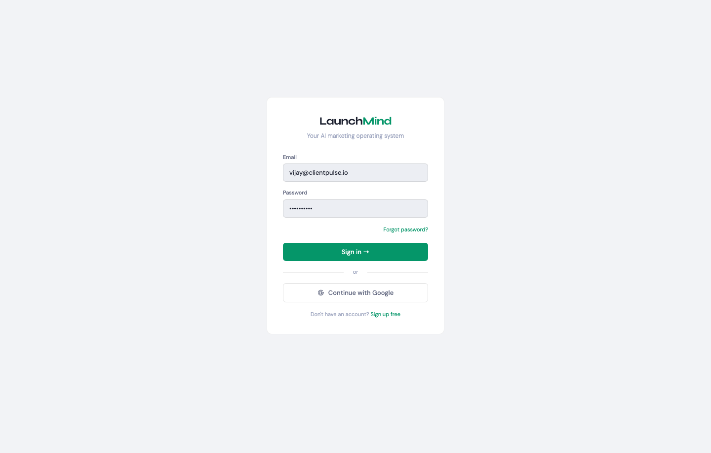

---

**Sign Up**

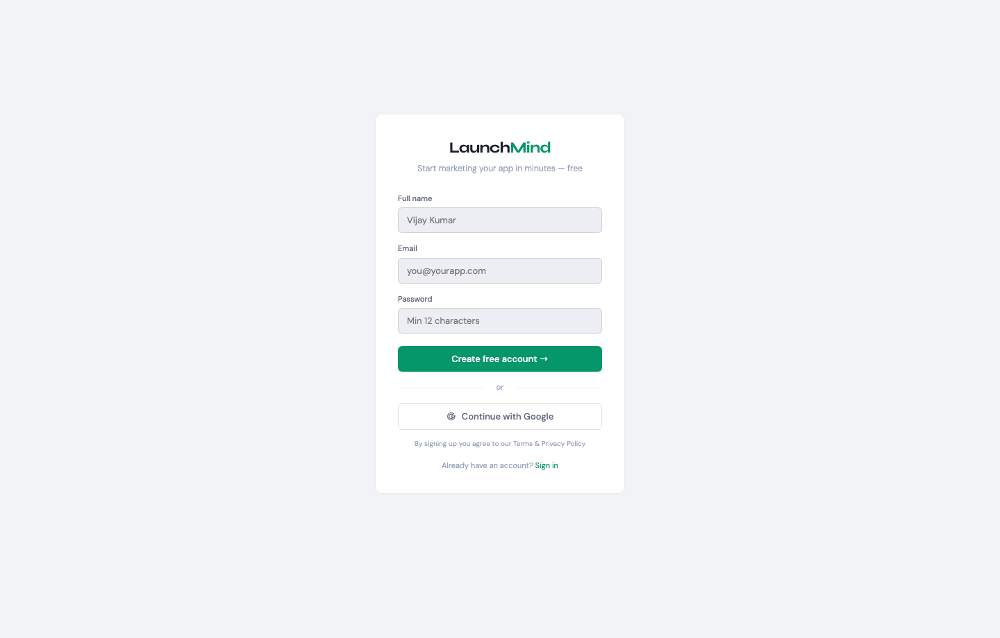

---

**MFA Verification**

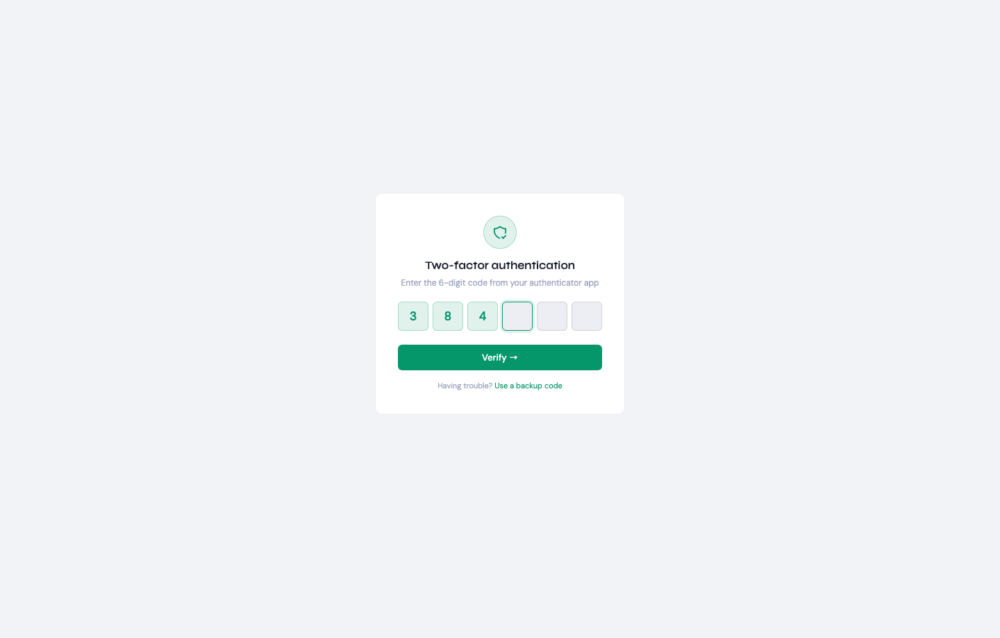

---

### Dashboard Screens

**Main Dashboard** — metric grid, product list, latest brief, channel performance table

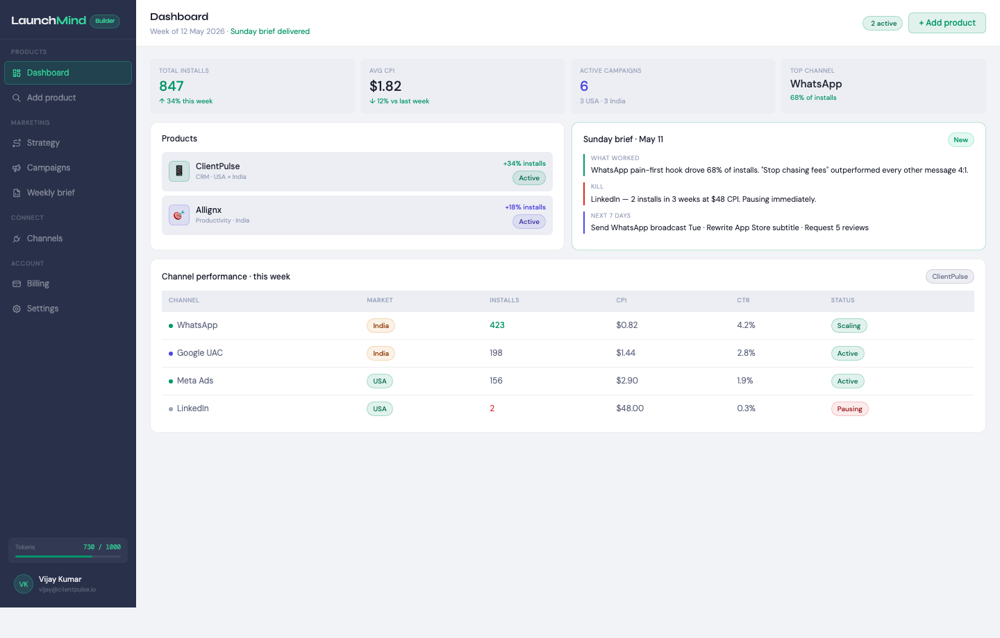

---

**Add Product — Step 1: URLs** (Discover) — multi-URL entry (App Store · Play Store · Website)

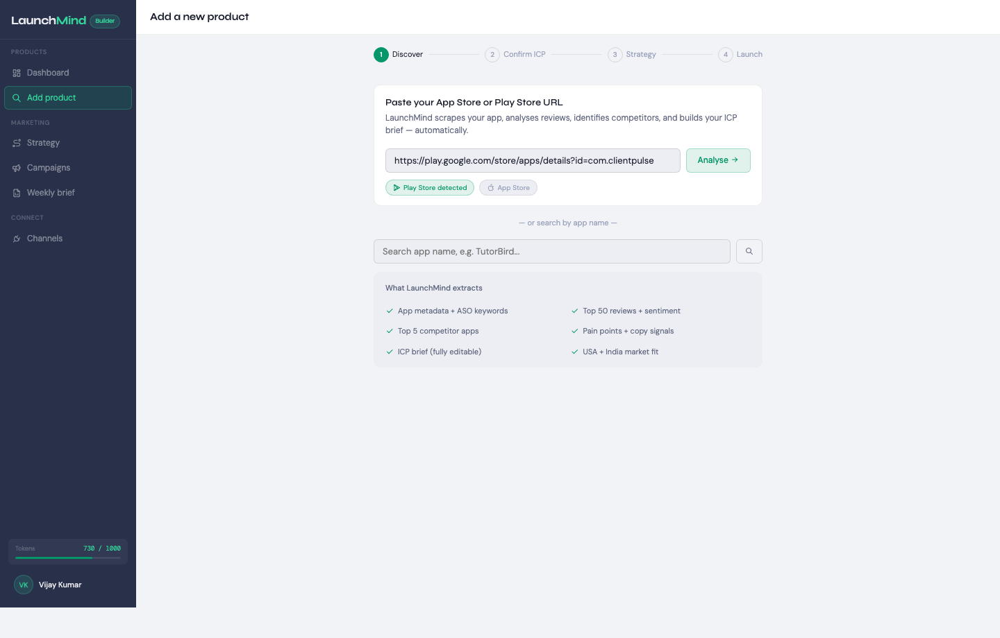

---

**Confirm ICP** — inline-editable ICP fields, competitor cards, MOAT box, best customer quote

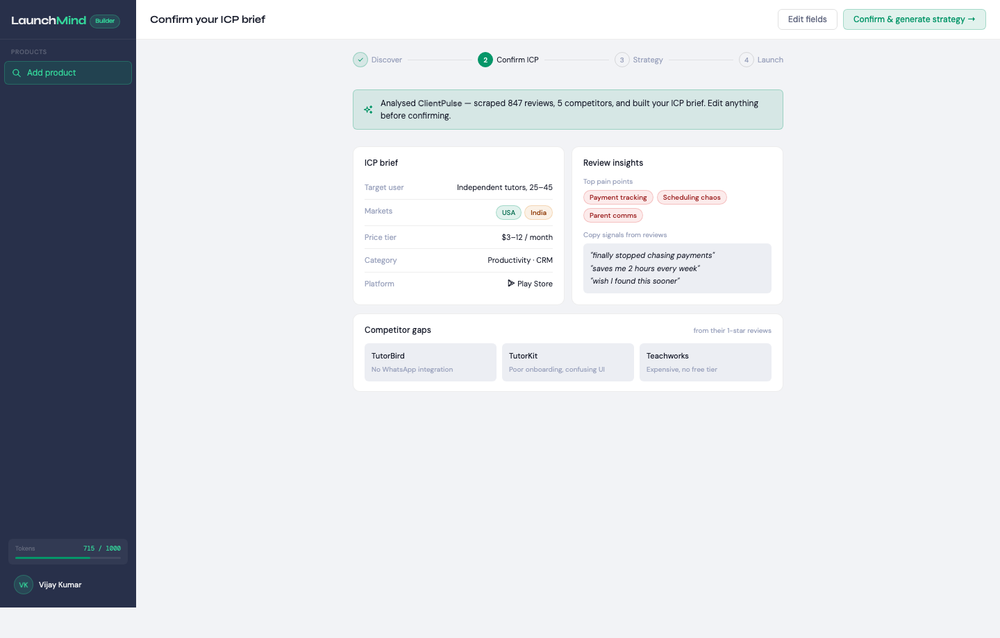

---

**Strategy** — 30/60/90 day plan, playbook insights (Builder/Studio), India tab

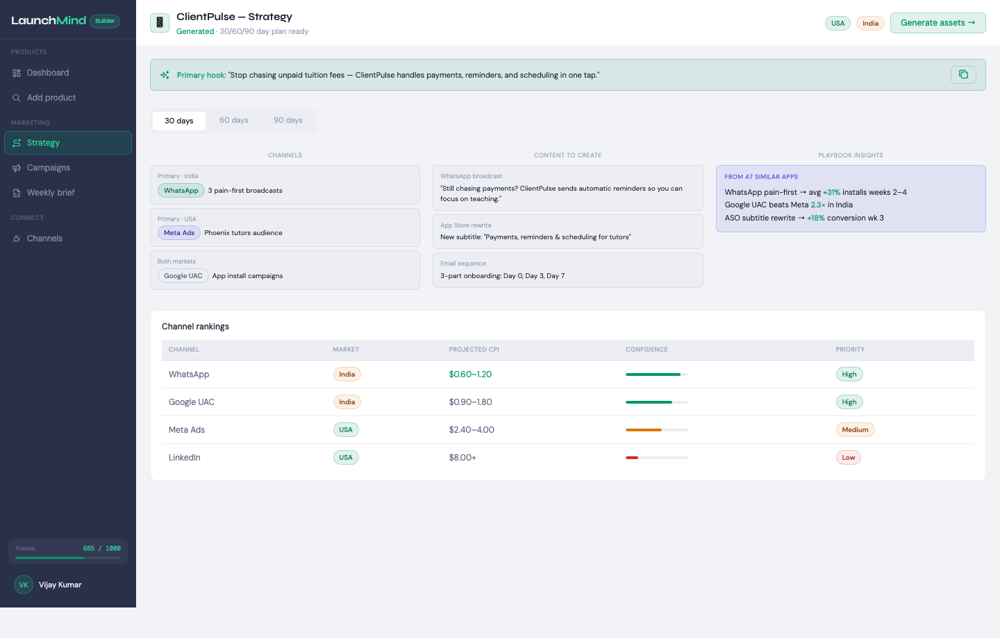

---

**Campaigns** — approval banner, channel table (bare icons), approve/pause/view actions

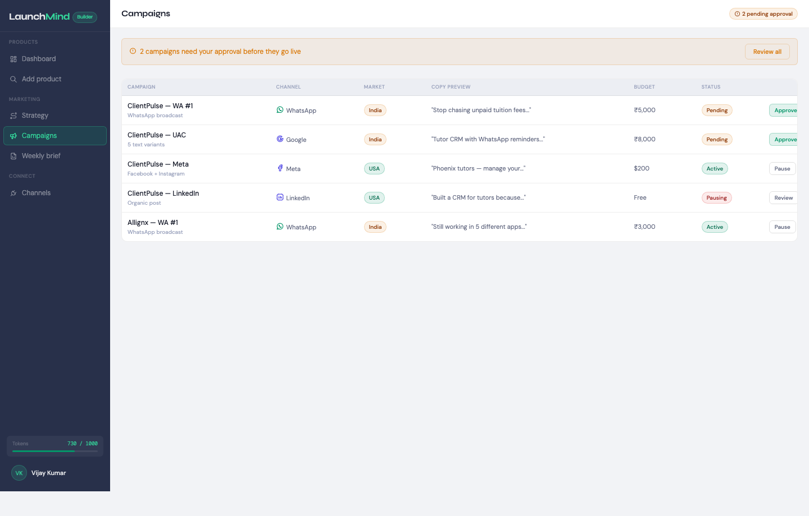

---

**Weekly Briefs** — 2-col layout: narrative (what worked / kill / next actions) + AssetBlock grid

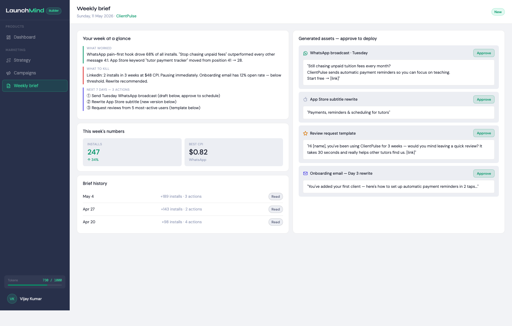

---

**Channels** — connection cards with sage border (connected), OAuth scopes, security grid

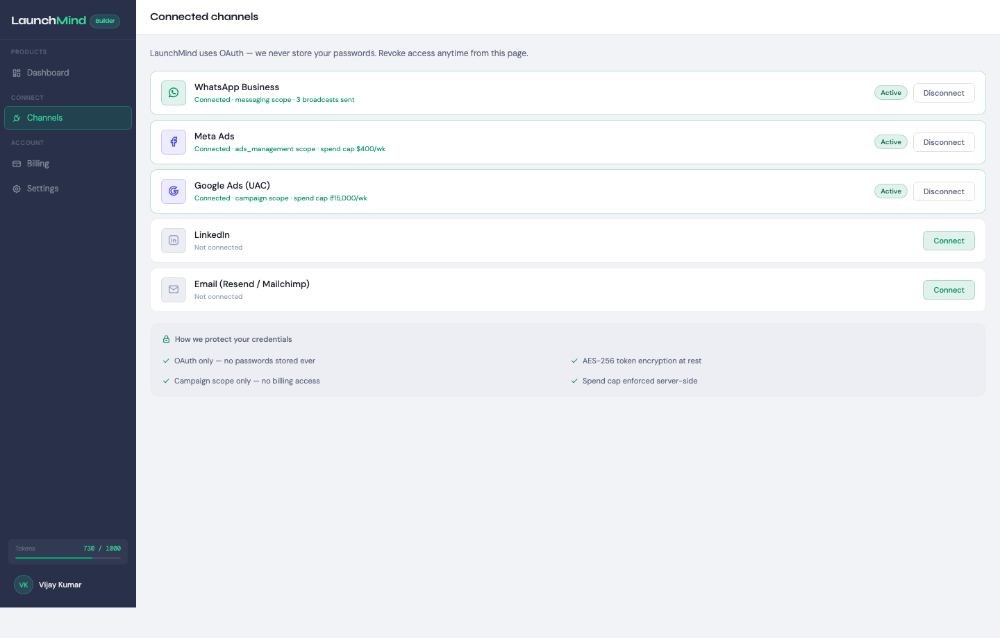

---

**Billing** — current plan, USD/INR toggle, 4-plan comparison grid, token top-up packs

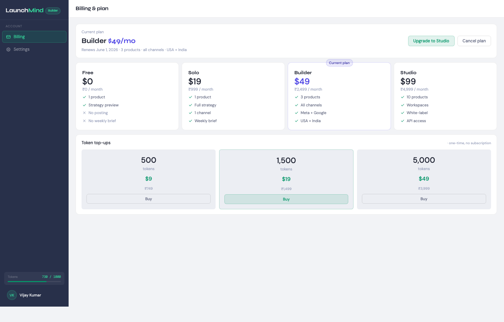

---

**Settings** — left-nav 7-tab layout: Profile · Security · Content Types · Voice Clone · Notifications · Products · Account

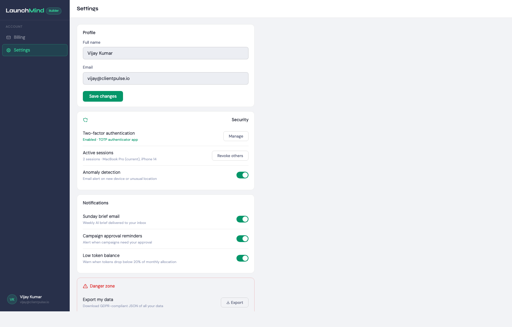

---

*LaunchMind · Built by Vijay Tomar · Phoenix, AZ · July 2026 · Built with Claude Code + claude-sonnet-4-6*
*Stack: Next.js 14 + Vercel · Fastify + Oracle Cloud VM · Supabase · pgvector · BullMQ · Claude API · Replicate · AWS KMS · Cloudflare*
*Markets: USA + India · Rule: Backend first · Additive migrations · Token-ready from day 1*
